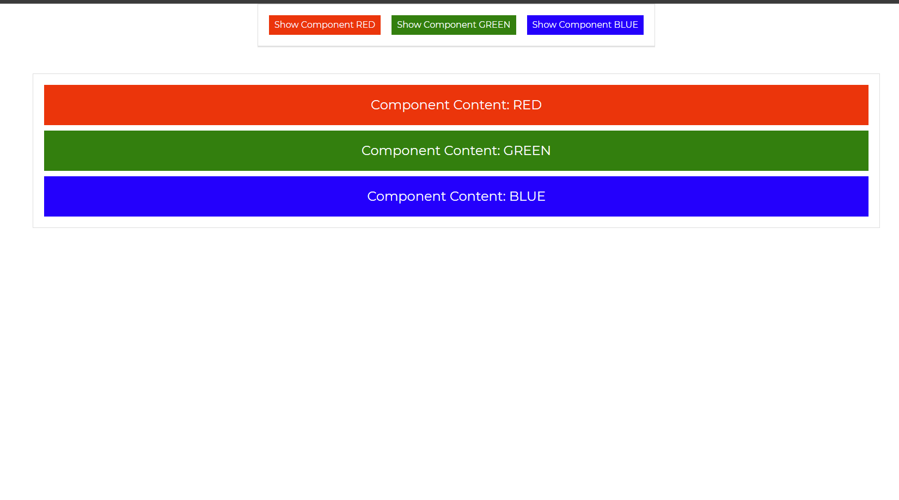

# desafio-avancado

#### Training front-end development with the Vue.js framework.
#

## Project setup and run:
```
npm install
npm run serve
```

## Colors Archive
```
./src/mocks/ColorsMock.js
```
# Project Image
